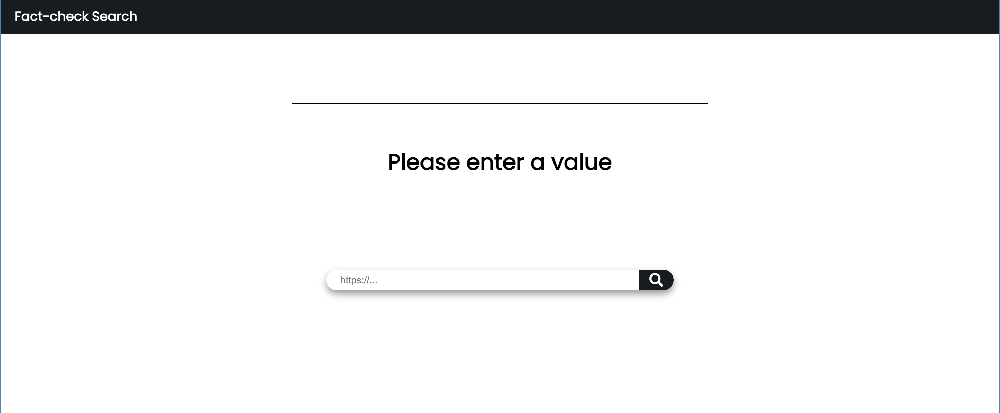

### Objectif de la semaine : 
- Finir l'implementation de mon Front End 
- Regler la question des algorithmes:
  1. Implémentation d'un algorithme de génerateur de query pour valider les résultats de recherche
  2. Generer une liste de 'champs' valides en fonctions de mots clefs reçus en paramètres.
- Avancer sur le crawler de mots-clefs site web

### Résumé de la semaine 
 
- J'ai pu mettre en place un UI  qui traduit l'ensemble des fonctionalités(je pourrais le rendre plus esthétique si le temps le permet)

- J'ai ajouté un mock backend(JS server) pour simuler les interactions avec le serveur.

- Au niveau du crawler, j'ai décider de me concentrer sur les variables meta les plus communs. J'ai pus commencé l'implémentaion 

Algorithmes: 
- La validation des query 

